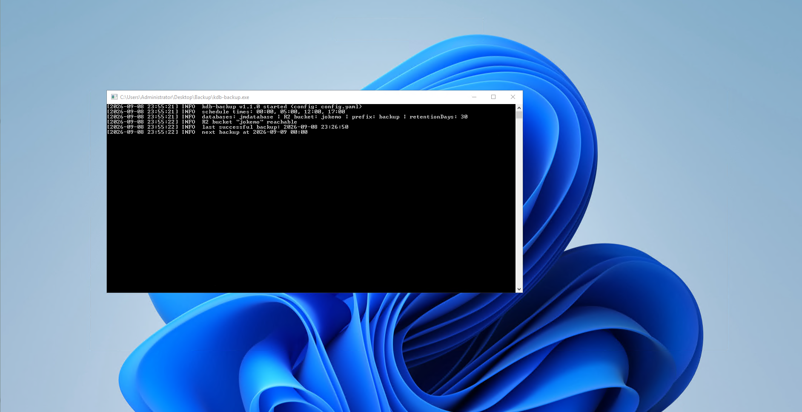
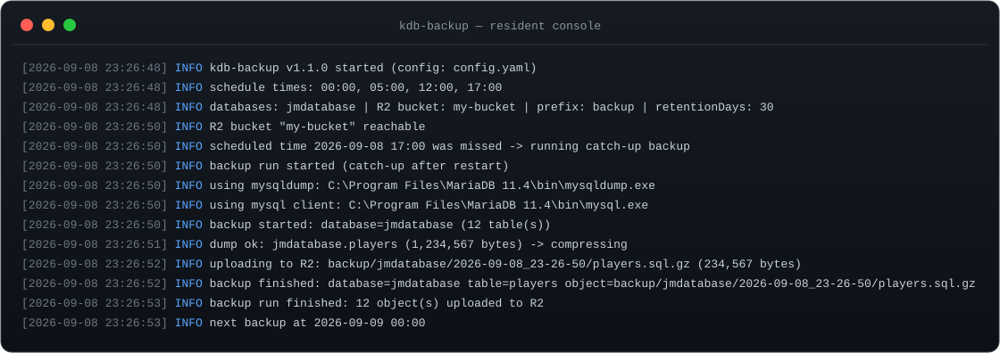
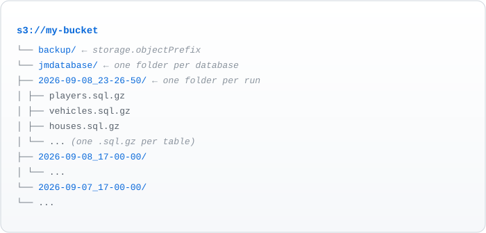

# kdb-backup

[](https://go.dev/dl/)
[](LICENSE)
[](#requirements)
[](https://www.cloudflare.com/r2/)



Automated **MariaDB** database backups to **Cloudflare R2**, delivered as a
single native **Windows console `.exe`**.

The program stays in the console and dumps every configured database with
`mysqldump` on a daily schedule (default `00:00`, `05:00`, `12:00`, `17:00`
machine-local time), compresses each dump with gzip, and uploads it to an R2
bucket through the S3 API. By default **each table is dumped, compressed and
uploaded as its own `.sql.gz` file** (one object per table, so you can restore
a single table without touching the rest); a single combined file per database
is still available via `storage.perTable: false`. Everything is configurable
from a YAML file — no recompilation needed — and optional retention cleanup
deletes old backups automatically.

Built with Go, the binary is native machine code with symbols stripped, which
makes it resistant to decompilation (see [Hardening](#hardening-and-decompilation)).

<details>
<summary><strong>Table of Contents</strong></summary>

- [Example output](#example-output)
- [Features](#features)
- [Requirements](#requirements)
- [Project layout](#project-layout)
- [Quick start](#quick-start)
  - [1. Build the executable](#1-build-the-executable-once-requires-go)
  - [2. Create the config file](#2-create-the-config-file)
  - [3. Prepare Cloudflare R2](#3-prepare-cloudflare-r2)
  - [4. Fill in config.yaml](#4-fill-in-configyaml)
  - [5. Validate and run](#5-validate-and-run)
- [Configuration reference](#configuration-reference)
  - [Object layout in R2](#object-layout-in-r2)
- [Usage](#usage)
  - [Resident mode vs. Windows Task Scheduler](#resident-mode-vs-windows-task-scheduler)
- [Deploying to a real server](#deploying-to-a-real-server)
  - [deploy.bat](#deploybat)
- [Restoring a backup](#restoring-a-backup)
- [How a backup run works](#how-a-backup-run-works)
- [Hardening and decompilation](#hardening-and-decompilation)
- [Security notes](#security-notes)
- [Troubleshooting](#troubleshooting)
- [Development](#development)

</details>

## Example output

What a resident run looks like on the console (and in `logging.logFile`):



## Features

- **Scheduled backups** at any list of daily times (`schedule.times`, default
  `00:00 / 05:00 / 12:00 / 17:00` local time)
- **Multiple databases** per run (default: `jmdatabase`)
- **Per-table backups** (default): every table becomes its own `.sql.gz` in
  R2, e.g. `backup/jmdatabase/<timestamp>/players.sql.gz` — restore any single
  table without the whole database. Set `storage.perTable: false` for one
  combined file per database instead
- **Complete dumps**: stored routines, triggers and events are included via
  `--routines --triggers --events`; `--single-transaction` for a consistent
  snapshot without locking InnoDB writes
- **gzip compression** before upload (or `none`)
- **Cloudflare R2 upload** (S3-compatible API, battle-tested `minio-go` client)
- **Retention cleanup**: automatically deletes R2 objects older than
  `storage.retentionDays`
- **Catch-up on startup**: if a scheduled time passed while the program was
  stopped (e.g. after a reboot), it runs one backup as soon as it starts
  (`schedule.catchUpOnStartup`)
- **No duplicate runs**: the timestamp of the last successful backup is stored
  in `state.json` next to the config
- **Secrets never hard-coded**: the config file supports `${ENV_VAR}`
  placeholders; the MariaDB password is passed to `mysqldump` through the
  `MYSQL_PWD` environment variable, never on the command line
- **Console-friendly commands**: `-validate`, `-once`, `-next`
- Fully **unit-tested** scheduler, config and compression logic

## Requirements

| Requirement | Notes |
|---|---|
| Windows 10/11 x64 | Where the `.exe` runs |
| `mysqldump.exe` | Ships with MariaDB/MySQL. Path is auto-detected (PATH, then common install folders: `Program Files\MariaDB*`, XAMPP, Laragon, WAMP) or set explicitly in `config.yaml` |
| `mysql.exe` | Only needed in per-table mode (the default) to list tables; auto-detected on PATH and next to `mysqldump`, or set via `database.mysqlPath` |
| Cloudflare R2 | An existing bucket and an API token with **Object Read & Write** (and bucket permissions) scoped to that bucket |
| Go 1.26+ | Only needed to build; the shipped `.exe` needs no runtime |

## Project layout

```
kdb-backup.exe          Built binary (console app)
config.example.yaml    Configuration template
config.go              Config loading, ${ENV_VAR} expansion, defaults
main.go                CLI flags, scheduler loop, catch-up, validation
backup.go              mysqldump -> gzip -> upload pipeline (per table or per database)
r2.go                  Cloudflare R2 client, upload, retention, gzip helper
scheduler.go           Schedule math + persisted state
log.go                 Timestamped console + file logger
main_test.go           Unit tests
build.bat              Windows build script
deploy.bat             Pack exe + config into a clean deploy folder
assets/                README example images (log output, R2 layout)
LICENSE                MIT license
.github/workflows/     CI: vet + test + build exe, release on version tags
```

## Quick start

### 1. Build the executable (once, requires Go)

From a terminal in the project folder:

```bat
build.bat
```

or manually:

```bat
go mod download
CGO_ENABLED=0 go build -trimpath -ldflags "-s -w" -o kdb-backup.exe .
```

The result is a single static `kdb-backup.exe` with no runtime dependencies.

> To make the binary considerably harder to reverse-engineer, build with
> [garble](https://github.com/burrowers/garble) instead:
> ```bat
> go install mvdan.cc/garble@latest
> garble -literals -tiny -ldflags "-s -w" build -o kdb-backup.exe .
> ```
> See [Hardening](#hardening-and-decompilation).

### 2. Create the config file

```bat
copy config.example.yaml config.yaml
```

### 3. Prepare Cloudflare R2

1. Cloudflare dashboard → **R2** → **Create bucket** (e.g. `kdb-backups`).
2. R2 → **Manage R2 API Tokens** → create a token with **Object Read &
   Write** scoped to that bucket.
3. Copy the **Access Key ID** and **Secret Access Key**.
4. Find your **Account ID** on the R2 overview page (right sidebar). Your
   endpoint is `https://<ACCOUNT_ID>.r2.cloudflarestorage.com`.

### 4. Fill in `config.yaml`

Edit the file and set at minimum:

```yaml
database:
  password: "your_mariadb_password"     # or "${MARIADB_PASSWORD}"
  databases:
    - "jmdatabase"

cloudflareR2:
  endpoint: "https://<ACCOUNT_ID>.r2.cloudflarestorage.com"
  accessKeyId: "<your_access_key_id>"
  secretAccessKey: "<your_secret_access_key>"
  bucket: "<your_bucket>"
```

Recommended: keep secrets out of the file using environment variables, e.g.

```yaml
database:
  password: "${MARIADB_PASSWORD}"
cloudflareR2:
  accessKeyId: "${R2_ACCESS_KEY_ID}"
  secretAccessKey: "${R2_SECRET_ACCESS_KEY}"
```

then set them once in Windows (`setx` takes effect in new terminals):

```bat
setx MARIADB_PASSWORD "your_mariadb_password"
setx R2_ACCESS_KEY_ID "your_access_key_id"
setx R2_SECRET_ACCESS_KEY "your_secret_access_key"
```

### 5. Validate and run

```bat
kdb-backup.exe -validate      REM check config, mysqldump, mysql client and R2 access
kdb-backup.exe -once          REM run one backup immediately and exit
kdb-backup.exe                REM stay in the console and run on schedule
```

## Configuration reference

Every string supports `${ENV_VAR}` / `$ENV_VAR` expansion.

| Section / field | Type | Default | Description |
|---|---|---|---|
| `database.mysqldumpPath` | string | `""` | Full path to `mysqldump.exe`. Empty = auto-detect |
| `database.mysqlPath` | string | `""` | Full path to `mysql.exe` (per-table mode only). Empty = auto-detect |
| `database.host` | string | `127.0.0.1` | MariaDB/MySQL host |
| `database.port` | int | `3306` | Server port |
| `database.user` | string | `root` | Backup user |
| `database.password` | string | `""` | Password (via `MYSQL_PWD`; use `${ENV_VAR}`) |
| `database.databases` | string[] | `["jmdatabase"]` | Databases to dump |
| `database.extraDumpOptions` | string[] | `--single-transaction --routines --triggers --events --hex-blob` | Extra `mysqldump` flags |
| `schedule.times` | string[] | `["00:00","05:00","12:00","17:00"]` | Daily backup times, 24h `HH:MM` local |
| `schedule.catchUpOnStartup` | bool | `true` | Run a backup on start if a slot was missed |
| `storage.compression` | string | `gzip` | `gzip` or `none` |
| `storage.perTable` | bool | `true` | `true` = one `.sql.gz` per table; `false` = one combined file per database |
| `storage.objectPrefix` | string | `backup` | R2 folder for backups |
| `storage.retentionDays` | int | `30` | Delete R2 objects older than N days (`0` = keep forever) |
| `cloudflareR2.endpoint` | string | — | `https://<ACCOUNT_ID>.r2.cloudflarestorage.com` |
| `cloudflareR2.accessKeyId` | string | — | R2 API token key id |
| `cloudflareR2.secretAccessKey` | string | — | R2 API token secret |
| `cloudflareR2.bucket` | string | — | Existing R2 bucket name |
| `cloudflareR2.region` | string | `auto` | R2 accepts `auto`; leave as is |
| `logging.logFile` | string | `""` | Append logs here; empty = console only |

> **`extraDumpOptions` note:** MySQL 8 / MariaDB 11 users may add
> `--set-gtid-purged=OFF`. Older MySQL 5.x builds (e.g. XAMPP) reject that
> flag, so it is intentionally not a default.

### Object layout in R2

Per-table mode (default) — one object per table, grouped by run timestamp:

```
backup/jmdatabase/2026-09-06_00-00-00/players.sql.gz
backup/jmdatabase/2026-09-06_00-00-00/vehicles.sql.gz
...
```

Single-file mode (`storage.perTable: false`):

```
backup/jmdatabase/2026-09-06_00-00-00.sql.gz
```



## Usage

| Command | Description |
|---|---|
| `kdb-backup.exe` | Resident mode: sleeps until the next scheduled time, backs up, repeats |
| `kdb-backup.exe -config <file>` | Use a different config path (default `config.yaml`) |
| `kdb-backup.exe -once` | Run a single backup immediately, then exit |
| `kdb-backup.exe -validate` | Check config, locate `mysqldump`/`mysql`, test R2 access, then exit |
| `kdb-backup.exe -next` | Print the next six upcoming backup times, then exit |
| `kdb-backup.exe -h` | Help |

**Exit codes:** `0` success, `1` backup/validation failure, `2` bad usage or
unreadable config. When double-clicked, the console stays open on error so the
message can be read.

### Resident mode vs. Windows Task Scheduler

- **Resident mode** (recommended for several daily times) keeps the schedule
  in-process; close the window to stop it. The catch-up feature covers
  restarts/reboots while the machine was off.
- **Task Scheduler** runs `-once` at boot or at a fixed time without an open
  window — e.g. one daily backup at `00:00`:

```bat
schtasks /Create /TN "kdb-backup" /TR "C:\path\to\kdb-backup.exe -once -config C:\path\to\config.yaml" /SC DAILY /ST 00:00 /F
```

For four runs per day via Task Scheduler, create four tasks with different
`/ST` times, or just leave the resident console app running.

## Deploying to a real server

Only **two files** are needed on the destination machine:

```
kdb-backup.exe
config.yaml
```

Everything else in this repository exists only for building the executable.
`config.yaml` is your edited copy of `config.example.yaml` (see
[Quick start](#quick-start)).

### deploy.bat

`deploy.bat` packs exactly those two files into a clean folder that you can
ship (zip, USB stick, network copy):

```bat
REM pack into .\deploy  (default; the folder is wiped and recreated)
deploy.bat

REM pack into a specific folder, e.g. on a USB stick
deploy.bat D:\backup
```

Behavior:

- **Refuses to run** if `kdb-backup.exe` or `config.yaml` is missing, or if
  you point it at the project root.
- **Never closes silently** — the window stays open with `Press any key to
  continue` after both success and failure, so double-clicking always shows
  you the result instead of a window that flashes and disappears.
- **Target inside the project** (default `deploy\`): deleted and recreated on
  every run, so the pack is always clean — keep nothing else in that folder.
- **Target outside the project**: the folder is created and files copied
  without wiping existing content.
- Prints a **shipping checklist** once packed: verify DB/R2 settings in
  `config.yaml`, ensure `mysqldump` exists on the destination, then run
  `-validate`, `-once`, confirm the `.sql.gz` appears in R2, and start the
  scheduler (resident console or Task Scheduler).

After copying the folder to the server, follow the checklist: the exe is a
standalone binary (no Go runtime needed) and `mysqldump` must be reachable on
that machine.

> **Security:** `config.yaml` contains credentials (DB password, R2 keys).
> Protect the folder permissions, and never commit `config.yaml` or the
> `deploy/` pack — both are in `.gitignore`.

## Restoring a backup

Download the objects from R2 (any S3 client works — `rclone`, `aws s3`, the
R2 dashboard), decompress and import.

**Per-table mode (default)** — restore a single table:

```bat
gzip -d players.sql.gz
mysql -u root -p jmdatabase < players.sql
```

Or restore the whole database by importing every table file in the run folder.
Each table file is self-contained (includes routines/triggers/events), and
because tables are dumped individually, foreign-key order can matter — import
with checks disabled if you hit FK errors:

```bat
mysql -u root -p -e "SET FOREIGN_KEY_CHECKS=0;" jmdatabase
REM then import each table, e.g.: gzip -dc players.sql.gz | mysql -u root -p jmdatabase
mysql -u root -p -e "SET FOREIGN_KEY_CHECKS=1;" jmdatabase
```

**Single-file mode** (`storage.perTable: false`):

```bat
gzip -d jmdatabase_2026-09-06_00-00-00.sql.gz
mysql -u root -p jmdatabase < jmdatabase_2026-09-06_00-00-00.sql
```

## How a backup run works

1. `mysqldump` (and, in per-table mode, the `mysql` client) is located
   (configured path → PATH → common install folders).
2. Per-table mode (default): `SHOW TABLES` lists the tables, then each table
   is dumped individually. Single-file mode: the whole database is dumped at
   once. In both modes routines, triggers and events are included and the
   password goes via `MYSQL_PWD`.
3. Every dump is compressed with gzip (`storage.compression`).
4. The finished `.sql.gz` files are uploaded to R2 under
   `objectPrefix/<db>/<timestamp>/<table>.sql.gz` (per-table) or
   `objectPrefix/<db>/<timestamp>.sql.gz` (single-file).
5. If `retentionDays > 0`, R2 objects under the prefix older than the cutoff
   are deleted.
6. On success the run timestamp is persisted to `state.json`; on failure it is
   not, so a restart can retry.

Missed runs are only retried **once** on startup (the latest missed slot), so a
long outage cannot trigger a pile-up of catch-up backups.

## Hardening and decompilation

Being written in Go, the binary is **native machine code** — not bytecode/IL
like .NET or Java — and the release build strips symbols and debug info
(`-ldflags "-s -w"`). Decompiling it yields assembly-level output that is
impractical to recover meaningful source from.

To raise the bar further:

```bat
go install mvdan.cc/garble@latest
garble -literals -tiny -ldflags "-s -w" build -o kdb-backup.exe .
```

`garble` obfuscates control flow, identifiers and string literals.

> **Honest caveat:** no compiled program is mathematically impossible to
> reverse-engineer — hardening makes it expensive and slow, not impossible.
> Therefore, never embed secrets in the binary. Credentials live in
> `config.yaml` (restrict its file permissions) or in environment variables,
> and the R2 token should be scoped to the backup bucket only.

## Security notes

- `config.yaml` contains credentials — restrict access to it (or keep secrets
  in environment variables referenced via `${VAR}`).
- The MariaDB password is exported as `MYSQL_PWD` to the `mysqldump` child
  process; it never appears in the process command line.
- R2 API tokens should be read/write **only on the backup bucket**.
- `state.json` (last successful run) is created next to the config file.
- `.gitignore` excludes `config.yaml`, `state.json`, `backup.log` and built
  `.exe` files so credentials are never committed by accident.

## Troubleshooting

| Symptom | Fix |
|---|---|
| `mysqldump not found` | Set `database.mysqldumpPath` to the full path, e.g. `C:\Program Files\MariaDB 11.4\bin\mysqldump.exe` |
| `mysql client not found` | Only in per-table mode: set `database.mysqlPath` to the full path, e.g. `C:\Program Files\MariaDB 11.4\bin\mysql.exe` |
| R2 `tls: handshake failure` | The endpoint host is wrong — use `https://<ACCOUNT_ID>.r2.cloudflarestorage.com` |
| `bucket ... does not exist` | Create the bucket, or check the token permission scope |
| `AccessDenied` on upload | The API token needs **Object Read & Write** for that bucket |
| Dump fails with `unknown variable` | Your `mysqldump` is older — remove MySQL 8-only flags from `extraDumpOptions` |
| Database connection refused | MariaDB service not running, wrong host/port/user/password in config |

Logs are written to the console and, if configured, to `logging.logFile`
(`backup.log` by default).

## Development

```bat
go vet .
go test ./...
```

The repository ships a GitHub Actions workflow (`.github/workflows/build.yml`)
that runs on every push to `main`: it vets, tests, builds `kdb-backup.exe` on a
Windows runner and uploads it as an Actions artifact. Pushing a version tag
(e.g. `git tag v1.1.0 && git push origin v1.1.0`) additionally creates a GitHub
**Release** with the `.exe` **and the `config.example.yaml` template** attached —
no local Go install needed, and the release is usable on its own: copy the
template to `config.yaml`, fill it in, run `kdb-backup.exe -validate`.
